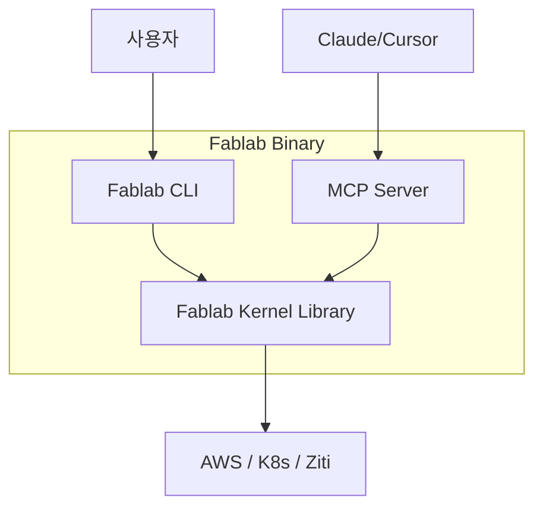

# MCP 서버 도입 시 Fablab CLI 관계 및 구현 전략

사용자께서 궁금해하신 **MCP 서버와 기존 CLI와의 공존 문제**, **기능 커버리지**, 그리고 **최적의 구현 방법**에 대한 분석입니다.

---

## 1. MCP 서버일 때 Fablab CLI 활용 여부 (CLI의 운명)

### 질문: MCP 서버가 생기면 CLI는 버려지나요?
**답변: 아닙니다. 오히려 "슈퍼 유저를 위한 도구"로 남아야 합니다.**

*   **역할 분담 (Role Separation)**:
    *   **MCP (AI/Chat Client)**: 일상적인 운영, 모니터링, 자연어 기반의 추상적인 명령("네트워크 상태 어때?", "테스트용 인스턴스 하나 만들어"). -> **접근성(Accessibility) 담당**.
    *   **CLI (Terminal)**: 긴급 복구, 디버깅, 스크립트 자동화, MCP 서버가 죽었을 때의 백업 제어 수단. -> **정밀 제어(Precision) 담당**.

*   **관계 설정**:
    *   초기에는 **CLI가 MCP 서버의 "클라이언트"**가 되는 구조가 가장 이상적입니다.
    *   예: 사용자가 터미널에서 `fablab create`를 치면, 내부적으로 로컬 로직을 돌리는 게 아니라 **실행 중인 MCP 서버(데몬)에 RPC 요청**을 보내는 식입니다. (Docker CLI가 Docker Daemon에 요청을 보내듯)

## 2. Fablab 모든 기능 사용 정도 (Feature Coverage)

### 질문: MCP로 Fablab의 모든 기능을 쓸 수 있어야 하나요?
**답변: "80:20 법칙"을 따르는 것을 추천합니다.**

*   **80% 자주 쓰는 기능 (Core Features) -> MCP 지원 (필수)**
    *   `create`, `delete`, `status`, `logs`, `scale`, `ssh_exec` 등 운영자가 매일 쓰는 기능.
    *   AI가 가장 잘 도와줄 수 있는 영역입니다.
*   **20% 엣지 케이스 (Low-level Tweak) -> CLI 유지 (권장)**
    *   복잡한 디버깅 옵션, 커널 내부 변수 조작, 컴파일 옵션 변경 등.
    *   이런 것까지 모두 MCP Tool로 만들면 프롬프트가 너무 복잡해지고 토큰 낭비가 심해집니다. AI에게도 과부하가 걸립니다.

**전략**: "모든 기능을 구현한다"가 아니라 **"AI가 이해했을 때 가치 있는 기능 위주로 구현한다"**가 정답입니다.

---

## 3. 최적 구현 방법 (Best Practice)

가장 효율적이고 유지보수하기 좋은 **"Unified Architecture"**를 제안합니다.

### A. 아키텍처: "One Core, Two Skins"

핵심 비즈니스 로직(Kernel)을 분리하고, CLI와 MCP가 이를 공유하는 구조입니다.



### B. 구현 패턴: `Service Layer` 도입

현재 Fablab 코드는 CLI(`cmd/`)와 로직(`kernel/`)이 다소 섞여 있습니다. (전역 변수 문제 등). 이를 다음과 같이 정리해야 합니다.

1.  **Service Layer (Kernel Wrapper)**:
    *   입출력이 명확한 Go 함수들의 집합. (전역 변수 X, Context O)
    *   `func (s *NetworkService) CreateNetwork(ctx, spec) error`

2.  **MCP Handler**:
    *   이 Service 함수를 단순히 감싸서(Wrap) JSON 스키마만 입히는 얇은 계층.
    *   ```go
        // MCP Tool Definition
        s.AddTool("create_network", ..., func(req) {
             // 단순히 Service 호출
             return service.CreateNetwork(req.Args)
        })
        ```

3.  **CLI Handler (Cobra)**:
    *   이 Service 함수를 호출하여 터미널에 뿌려주는 얇은 계층.
    *   ```go
        // Cobra Command
        Run: func(cmd, args) {
             // 단순히 Service 호출
             service.CreateNetwork(ParseArgs(args))
        }
        ```

### C. 배포 전략: "Single Binary, Dual Mode"

하나의 실행 파일(`fablab`)이 실행 인자(Flag)에 따라 역할을 바꾸게 합니다.

*   `fablab server start --mcp`: MCP 서버(데몬) 모드로 실행. 백그라운드 상주.
*   `fablab create ...`: 기본 CLI 모드. (필요 시 로컬 로직 실행, 또는 서버에 요청 전달)

## 4. 요약 및 제언

1.  **CLI는 죽지 않는다**: 정밀 제어용으로 남겨두고, MCP는 편의성/자동화용으로 키우십시오.
2.  **핵심 기능 집중**: MCP에 모든 기능을 억지로 우겨넣지 말고, "AI가 잘할 수 있는 일(조회, 요약, 단순/반복 작업)"부터 구현하십시오.
3.  **Kernel 분리**: `cmd`와 `mcp`가 공통으로 사용할 수 있는 **Stateless한 Service Layer**를 만드는 리팩토링이 선행되어야 합니다. 이것이 가장 "최적의 구현 방법"의 핵심입니다.
